<p align="center">
  <!--  -->
  <br/><a href="https://cocoapods.org/pods/SuperAlertControllerPickers">
  
  
  
  
  <br/>
  
  
  <br/>
  
  
  
  </a>
</p>

# Introduction

## What's this?

Extensions for [`SuperAlertController`](https://github.com/Meniny/SuperAlertController/).

## Preview

<table>
<tr>
<td>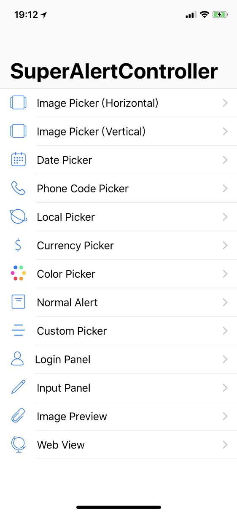</td>
</tr>
<tr>
<td>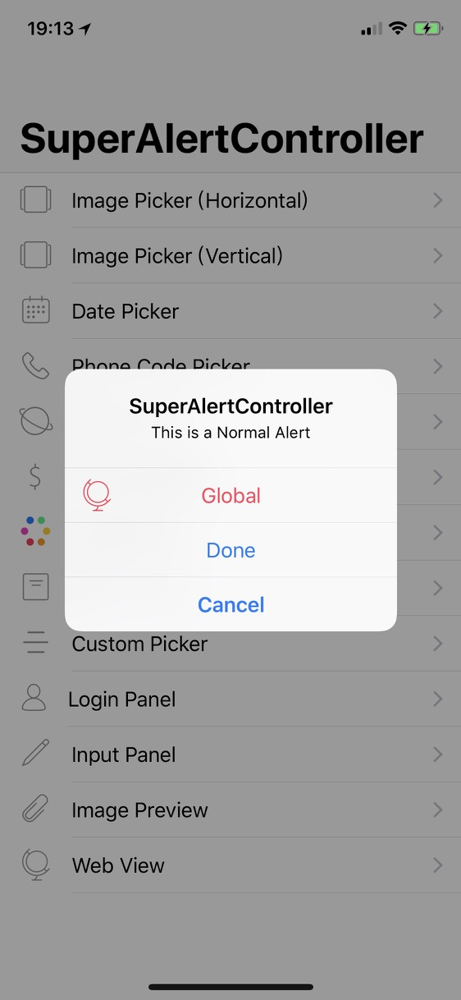</td>
<td>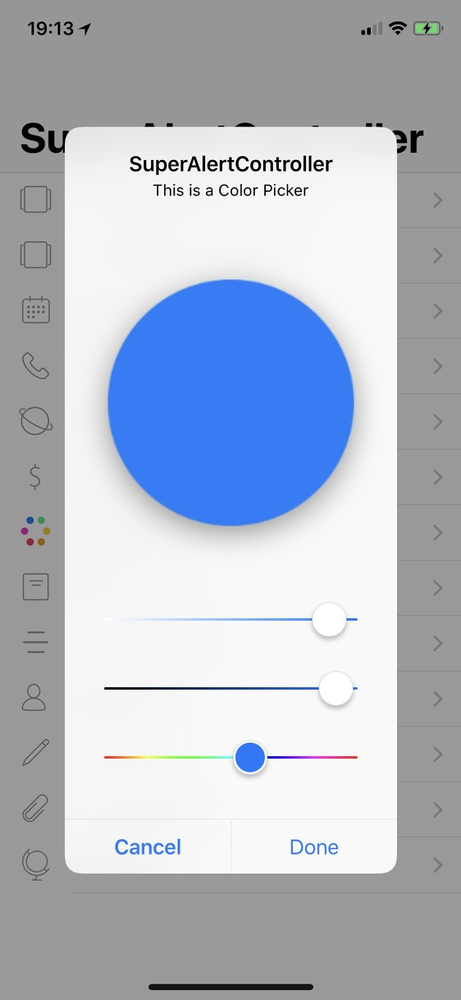</td>
</tr>
<tr>
<td>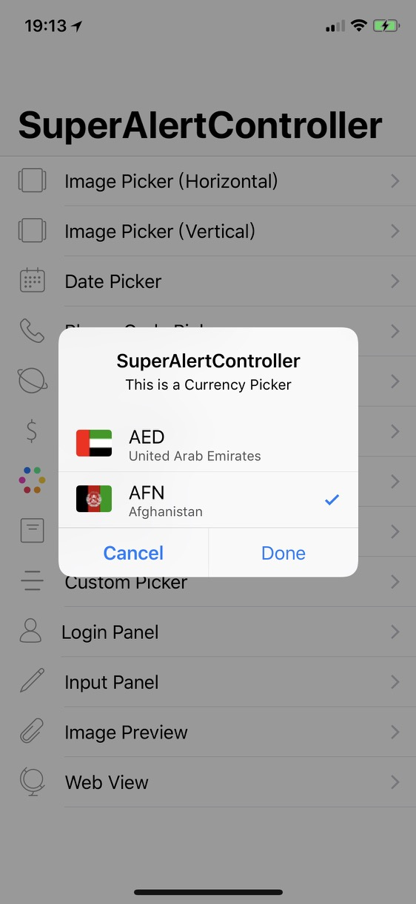</td>
<td>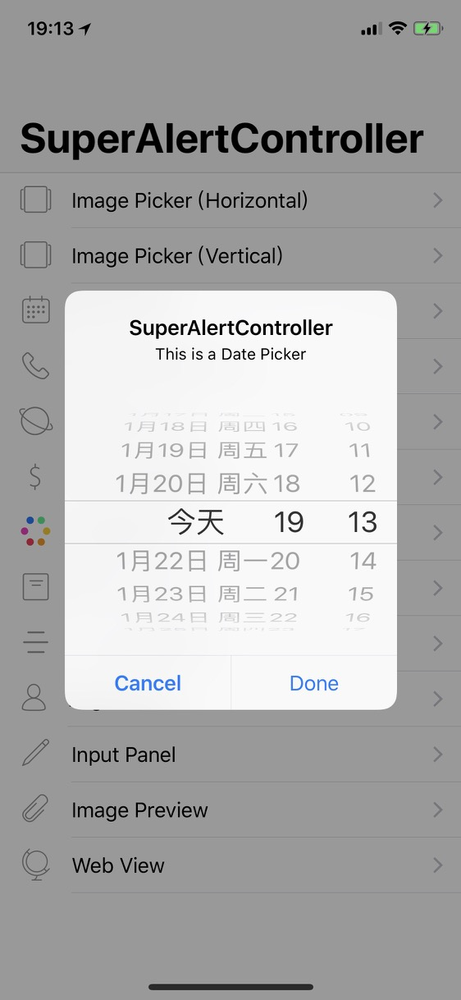</td>
</tr>
<tr>
<td>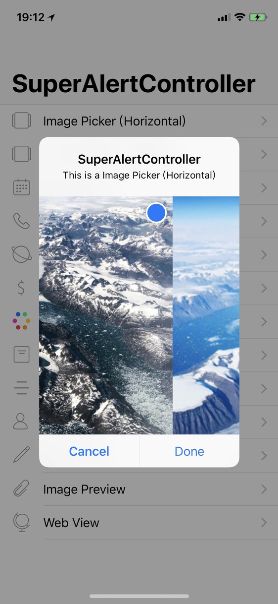</td>
<td>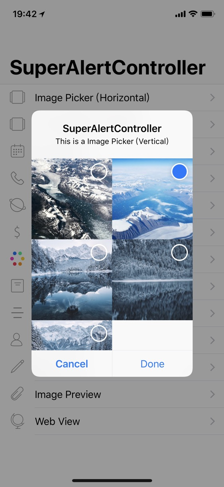</td>
</tr>
<tr>
<td>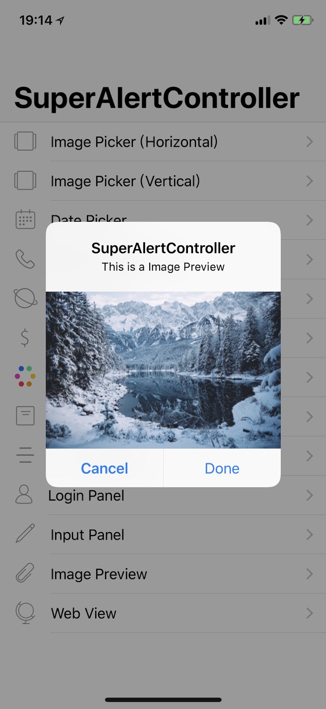</td>
<td>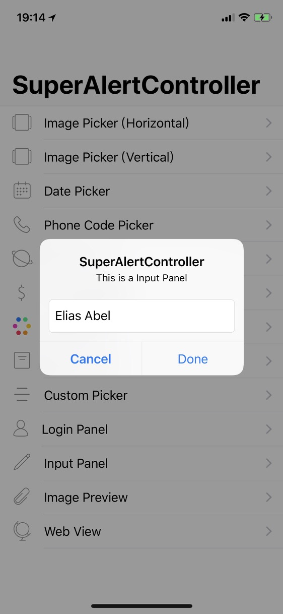</td>
</tr>
<tr>
<td>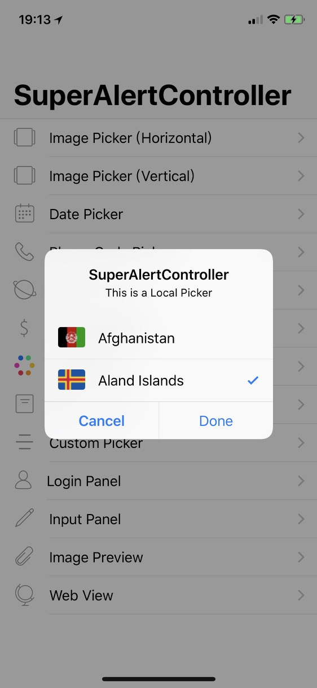</td>
<td>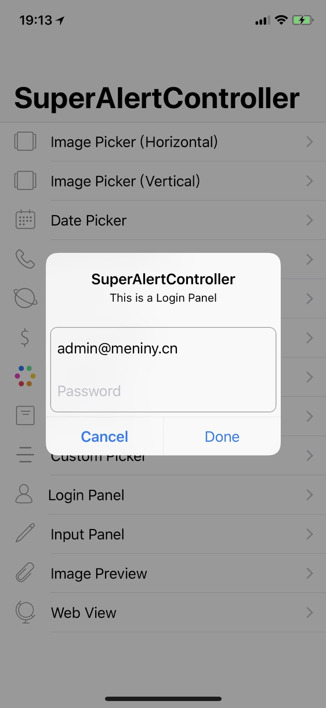</td>
</tr>
<tr>
<td>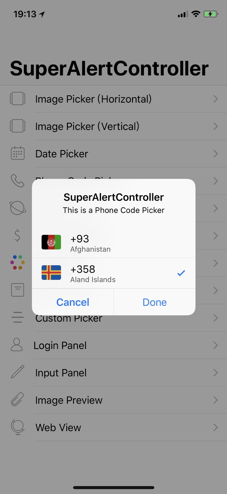</td>
<td>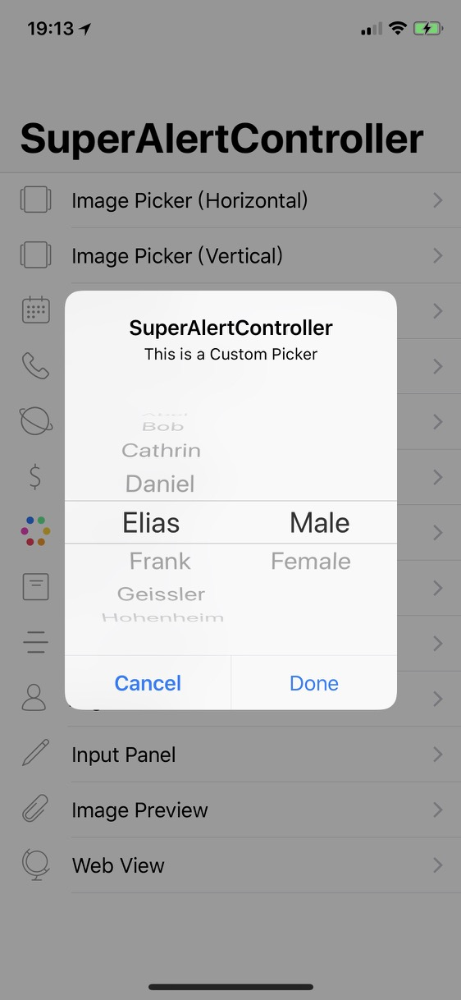</td>
</tr>
<tr>
<td>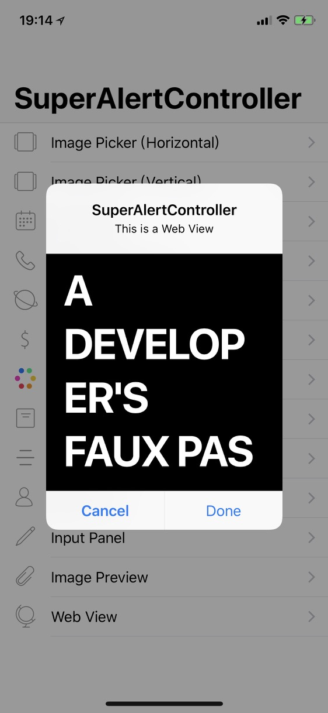</td>
<td>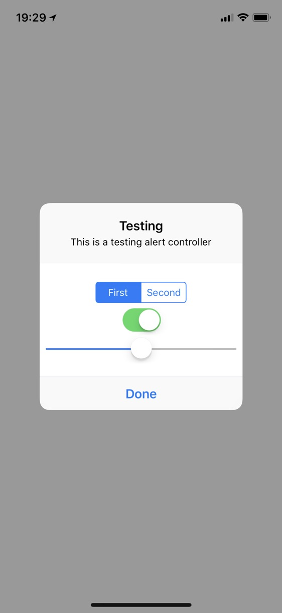</td>
</tr>
</table>

## Requirements

* iOS 9.0+
* Xcode 9 with Swift 4

## Installation

#### CocoaPods

```ruby
pod 'SuperAlertControllerPickers'
```

## Contribution

You are welcome to fork and submit pull requests.

## License

`SuperAlertController+Pickers` is open-sourced software, licensed under the `MIT` license.
